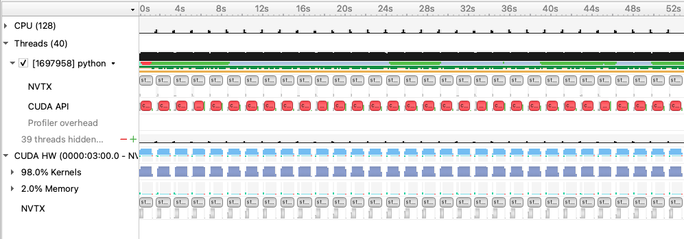
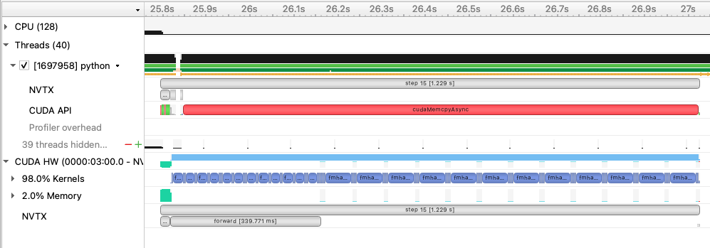
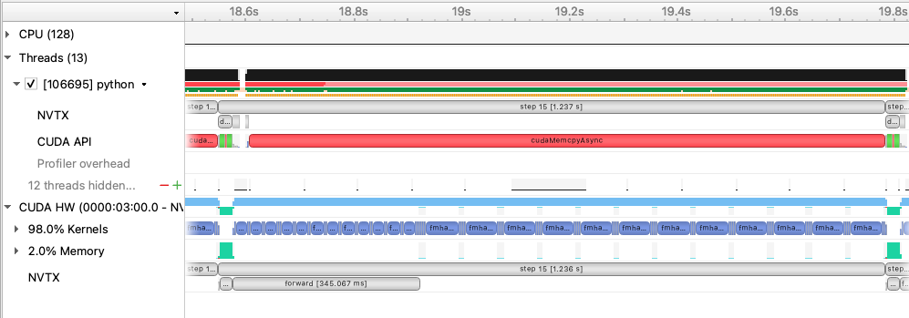
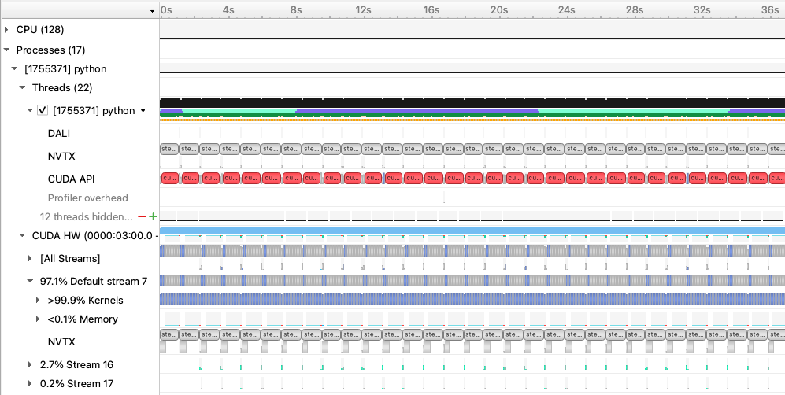
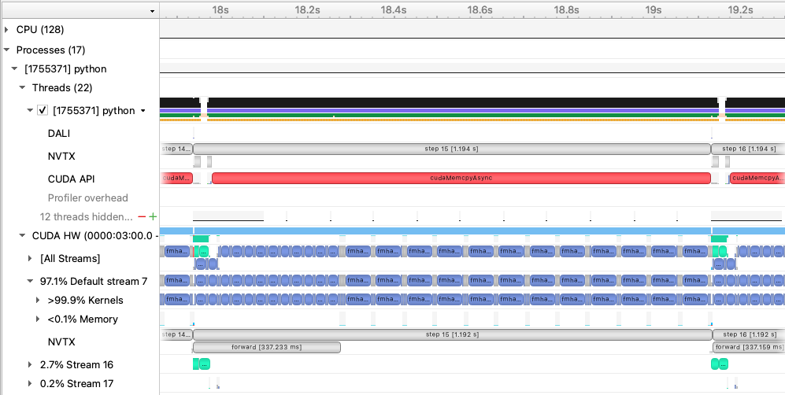
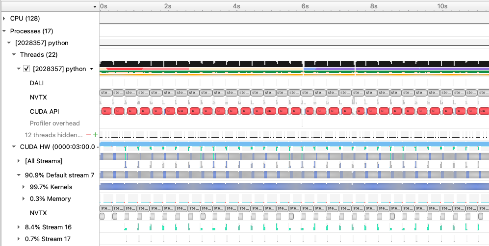
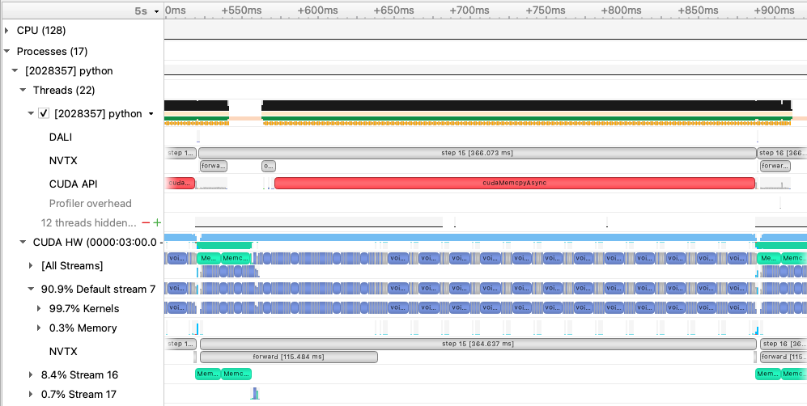
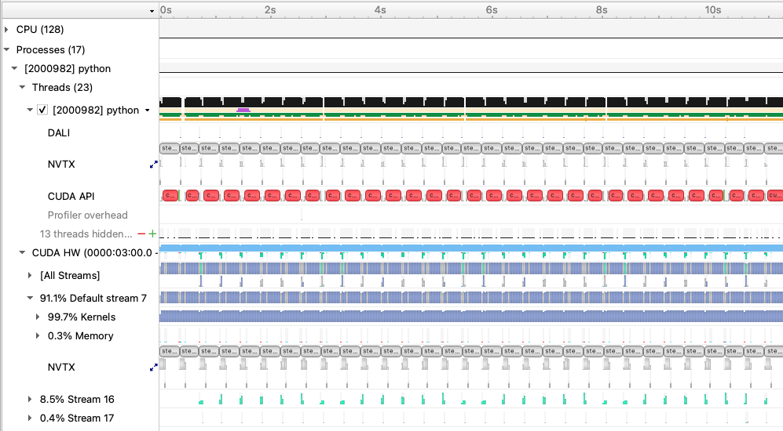
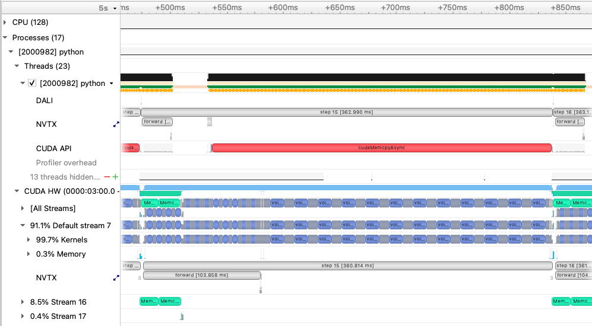

# sc23-tutorial

## Single GPU training

First, let us look at the performance of the training script without optimizations on a single GPU.

On Perlmutter for the tutorial, we will be submitting jobs to the batch queue. To submit this job, use the following command:
```
sbatch -n 1 ./submit_pm.sh --config=short --num_epochs 4
```
`submit_pm.sh` is a batch submission script that defines resources to be requested by SLURM as well as the command to run.
Note that any arguments for `train.py`, such as the desired config (`--config`), can be added after `submit_pm.sh` when submitting, and they will be passed to `train.py` properly.
When using batch submission, you can see the job output by viewing the file `vit-era5-<jobid>.out` in the submission
directory. You can find the job id of your job using the command `squeue --me` and looking at the first column of the output.

For interactive jobs, you can run the Python script directly using the following command (**NOTE: please don't run training on the Perlmutter login nodes**):
```
python train.py --config=short --num_epochs 4
```
This will run 4 epochs of training on a single GPU using a default batch size of 16.
See [`config/ViT.yaml`](config/ViT.yaml) for specific configuration details. For 
Note we will use the default batch size for the optimization work in the next section
and will push beyond to larger batch sizes in the distributed training section.

In the baseline configuration, the model converges to a loss of about `???` on
the validation dataset in ??? epochs. This takes around ??? hours to run, so to save time we have already included an example TensorBoard log for the `base` config in the `example_logs` directory for you.
We want to compare our training results against the `base` config baseline, and TensorBoard makes this easy as long as all training runs are stored in the same place. 
To copy the example TensorBoard log to the scratch directory where our training jobs will output their logs, do
```
mkdir -p $SCRATCH/sc23-dl-tutorial/logs
cp -r ./example_logs/base $SCRATCH/sc23-dl-tutorial/logs
```

To view results in TensorBoard, open the [`start_tensorboard.ipynb`](start_tensorboard.ipynb) notebook and follow the instructions in it to launch a TensorBoard session in your browser. Once you have TensorBoard open, you should see a dashboard with data for the loss values, learning rate, and average iterations per second. Looking at the validation loss for the `base` config, you should see the following training curve:


As our training with the `short` config runs, it should also dump the training metrics to the TensorBoard directory, and TensorBoard will parse the data and display it for you. You can hit the refresh button in the upper-right corner of TensorBoard to update the plots with the latest data.

## Single GPU performance profiling and optimization

This is the performance of the baseline script for the first four epochs on a 40GB A100 card with batch size 16 using the `short` config, which limits the number of training and validation samples to 512 and 128 samples respectively:
```
2023-09-26 21:29:00,679 - root - INFO - Starting Training Loop...
2023-09-26 21:30:08,688 - root - INFO - Time taken for epoch 1 is 63.020848512649536 sec, avg 8.12429556382808 samples/sec
2023-09-26 21:30:08,690 - root - INFO -   Avg train loss=0.579061
2023-09-26 21:30:17,316 - root - INFO -   Avg val loss=0.419114
2023-09-26 21:30:17,316 - root - INFO -   Total validation time: 8.258756637573242 sec
2023-09-26 21:31:11,898 - root - INFO - Time taken for epoch 2 is 54.578805923461914 sec, avg 9.380930772248819 samples/sec
2023-09-26 21:31:11,898 - root - INFO -   Avg train loss=0.390744
2023-09-26 21:31:18,989 - root - INFO -   Avg val loss=0.375897
2023-09-26 21:31:18,989 - root - INFO -   Total validation time: 6.766376972198486 sec
2023-09-26 21:32:13,578 - root - INFO - Time taken for epoch 3 is 54.58618688583374 sec, avg 9.37966231403635 samples/sec
2023-09-26 21:32:13,579 - root - INFO -   Avg train loss=0.356790
2023-09-26 21:32:20,685 - root - INFO -   Avg val loss=0.353825
2023-09-26 21:32:20,685 - root - INFO -   Total validation time: 6.767474889755249 sec
2023-09-26 21:33:15,322 - root - INFO - Time taken for epoch 4 is 54.63401126861572 sec, avg 9.371451740614114 samples/sec
2023-09-26 21:33:15,322 - root - INFO -   Avg train loss=0.343523
2023-09-26 21:33:22,444 - root - INFO -   Avg val loss=0.347524
2023-09-26 21:33:22,444 - root - INFO -   Total validation time: 6.78272819519043 sec
```
After the first epoch, we see that the throughput achieved is about 9.3 samples/s.

### Profiling with Nsight Systems
#### Adding NVTX ranges and profiler controls
Before generating a profile with Nsight, we can add NVTX ranges to the script to add context to the produced timeline.
We can add some manually defined NVTX ranges to the code using `torch.cuda.nvtx.range_push` and `torch.cuda.nvtx.range_pop`.
We can also add calls to `torch.cuda.profiler.start()` and `torch.cuda.profiler.stop()` to control the duration of the profiling
(e.g., limit profiling to single epoch). You can `grep` through `train.py` for these API calls to see what we've added in this example.

To generate a profile using our scripts on Perlmutter, run the following command: 
```
ENABLE_PROFILING=1 PROFILE_OUTPUT=baseline sbatch -n1 submit_pm.sh --config=short --num_epochs 4
```
If running interactively, this is the full command from the batch submission script:
```
nsys profile -o baseline --trace=cuda,nvtx -c cudaProfilerApi --kill none -f true python train.py --config=short --num_epochs 4
```
This command will run four epochs of the training script, profiling only the last epoch run. It will produce a file `baseline.nsys-rep` that can be opened in the Nsight System's program. The arg `--trace=cuda,nvtx` is optional and is used here to disable OS Runtime tracing for speed. The arg `-c cudaProfilerApi` instructs the profiler to only profile the duration of the runtime between the `torch.cuda.profiler.start()` and `torch.cuda.profiler.stop()` calls.

Loading this profile ([`baseline.nsys-rep`](sample_nsys_profiles/baseline.nsys-rep)) in Nsight Systems will look like this:


From this zoomed out view, we can see a lot idle gaps between iterations. These gaps are due to the data loading, which we will address in the next section.

Beyond this, we can zoom into a single iteration and get an idea of where compute time is being spent:



### Data loading optimizations
#### Improving the native PyTorch dataloader performance
The PyTorch dataloader has several knobs we can adjust to improve performance. If you look at the `DataLoader` initialization in
`utils/data_loader.py`, you'll see we've already set several useful options, like `pin_memory` and `persistent_workers`.
`pin_memory` has the data loader read input data into pinned host memory, which typically yields better host-to-device and device-to-host
memcopy bandwidth. `persistent_workers` allows PyTorch to reuse workers between epochs, instead of the default behavior which is to
respawn them. One knob we've left to adjust is the `num_workers` argument, which we can control via the `--num_data_workers` command
line arg to our script. The default used by PyTorch is `num_workers=0`, which runs data loading *sequentially* in the training Python process. This is one source of the large gaps we observed in the first profile. By setting `num_workers>0`, we enable PyTorch to use multiprocessing to perform data loading in a side process to hide this cost. We can experiment with the number of workers to see if performance is improved.

We can run this experiment on Perlmutter by running the following command:
```
sbatch -n 1 ./submit_pm.sh --config=short --num_epochs 4 --num_data_workers <value of your choice>
```
If running interactively:
```
python train.py --config=short --num_epochs 4 --num_data_workers <value of your choice>
```

This is the performance of the training script for the first four epochs on a 40GB A100 card with batch size 16 and 4 data workers:
```
2023-09-26 21:18:44,034 - root - INFO - Time taken for epoch 1 is 43.38622999191284 sec, avg 11.800979252989633 samples/sec
2023-09-26 21:18:44,035 - root - INFO -   Avg train loss=0.577452
2023-09-26 21:18:49,678 - root - INFO -   Avg val loss=0.418861
2023-09-26 21:18:49,679 - root - INFO -   Total validation time: 5.192107677459717 sec
2023-09-26 21:19:30,999 - root - INFO - Time taken for epoch 2 is 41.31834650039673 sec, avg 12.391589774655767 samples/sec
2023-09-26 21:19:31,001 - root - INFO -   Avg train loss=0.390701
2023-09-26 21:19:36,231 - root - INFO -   Avg val loss=0.372989
2023-09-26 21:19:36,232 - root - INFO -   Total validation time: 4.828763484954834 sec
2023-09-26 21:20:17,169 - root - INFO - Time taken for epoch 3 is 40.93515610694885 sec, avg 12.507586355902198 samples/sec
2023-09-26 21:20:17,171 - root - INFO -   Avg train loss=0.356448
2023-09-26 21:20:22,409 - root - INFO -   Avg val loss=0.355308
2023-09-26 21:20:22,409 - root - INFO -   Total validation time: 4.8364222049713135 sec
2023-09-26 21:21:03,627 - root - INFO - Time taken for epoch 4 is 41.21541452407837 sec, avg 12.42253671137738 samples/sec
2023-09-26 21:21:03,629 - root - INFO -   Avg train loss=0.343769
2023-09-26 21:21:08,695 - root - INFO -   Avg val loss=0.347322
2023-09-26 21:21:08,695 - root - INFO -   Total validation time: 4.662991523742676 sec
```

This is the performance of the training script for the first four epochs on a 40GB A100 card with batch size 16 and 8 data workers:
```
2023-09-26 21:18:59,332 - root - INFO - Time taken for epoch 1 is 45.54166626930237 sec, avg 11.242452065156796 samples/sec
2023-09-26 21:18:59,333 - root - INFO -   Avg train loss=0.577049
2023-09-26 21:19:05,821 - root - INFO -   Avg val loss=0.419312
2023-09-26 21:19:05,821 - root - INFO -   Total validation time: 6.034433841705322 sec
2023-09-26 21:19:47,276 - root - INFO - Time taken for epoch 2 is 41.4513418674469 sec, avg 12.351831736527942 samples/sec
2023-09-26 21:19:47,277 - root - INFO -   Avg train loss=0.389672
2023-09-26 21:19:53,126 - root - INFO -   Avg val loss=0.373399
2023-09-26 21:19:53,126 - root - INFO -   Total validation time: 5.442654848098755 sec
2023-09-26 21:20:36,164 - root - INFO - Time taken for epoch 3 is 43.03392195701599 sec, avg 11.897590940268149 samples/sec
2023-09-26 21:20:36,165 - root - INFO -   Avg train loss=0.355648
2023-09-26 21:20:41,650 - root - INFO -   Avg val loss=0.353144
2023-09-26 21:20:41,650 - root - INFO -   Total validation time: 5.0764687061309814 sec
2023-09-26 21:21:24,205 - root - INFO - Time taken for epoch 4 is 42.55116081237793 sec, avg 12.032574205380119 samples/sec
2023-09-26 21:21:24,206 - root - INFO -   Avg train loss=0.342547
2023-09-26 21:21:30,034 - root - INFO -   Avg val loss=0.346312
2023-09-26 21:21:30,034 - root - INFO -   Total validation time: 5.32970404624939 sec
```

This is the performance of the training script for the first four epochs on a 40GB A100 card with batch size 16 and 16 data workers:
```
2023-09-26 21:27:28,037 - root - INFO - Time taken for epoch 1 is 47.84179139137268 sec, avg 10.701940397915974 samples/sec
2023-09-26 21:27:28,037 - root - INFO -   Avg train loss=0.575174
2023-09-26 21:27:34,156 - root - INFO -   Avg val loss=0.418625
2023-09-26 21:27:34,156 - root - INFO -   Total validation time: 5.6687445640563965 sec
2023-09-26 21:28:20,330 - root - INFO - Time taken for epoch 2 is 46.170273542404175 sec, avg 11.089386324076328 samples/sec
2023-09-26 21:28:20,331 - root - INFO -   Avg train loss=0.388281
2023-09-26 21:28:25,466 - root - INFO -   Avg val loss=0.373171
2023-09-26 21:28:25,467 - root - INFO -   Total validation time: 4.725477695465088 sec
2023-09-26 21:29:11,989 - root - INFO - Time taken for epoch 3 is 46.51985311508179 sec, avg 11.006053667740602 samples/sec
2023-09-26 21:29:11,991 - root - INFO -   Avg train loss=0.354430
2023-09-26 21:29:17,389 - root - INFO -   Avg val loss=0.351720
2023-09-26 21:29:17,390 - root - INFO -   Total validation time: 4.990921974182129 sec
2023-09-26 21:30:02,644 - root - INFO - Time taken for epoch 4 is 45.25181460380554 sec, avg 11.314463397384783 samples/sec
2023-09-26 21:30:02,645 - root - INFO -   Avg train loss=0.341476
2023-09-26 21:30:07,853 - root - INFO -   Avg val loss=0.345648
2023-09-26 21:30:07,853 - root - INFO -   Total validation time: 4.801238775253296 sec
```

Increasing the number of workers to 4 improves throughput to around 12.4 samples per second, while increasing to more workers yields a slight degradation in performance.

We can run the 4 worker configuration through profiler using the instructions in the previous section with the added `--num_data_workers`
argument and load that profile in Nsight Systems. This is what this profile ([`4workers.nsys-rep`](sample_nsys_profiles/4workers.nsys-rep)) looks like:


and zoomed in:


With 4 data workers, the large gaps between steps somewhat alleviated, improving the throughput. However, from the zoomed out view, we still see large gaps between groups of 16 iterations. Looking at the zoomed in profile, we
still see that the H2D copy in of the input data takes some time and runs in same CUDA stream as the compute. One option here is to implement a prefetching
mechanism in PyTorch directly using CUDA streams to concurrently load and copy in the next batch of input during the current batch, however
this is left as an exercise outside of this tutorial. A good example of this can be found in [here](https://github.com/NVIDIA/DeepLearningExamples/blob/master/PyTorch/Classification/ConvNets/image_classification/dataloaders.py#L347).

#### Using NVIDIA DALI
While we were able to get more performance out of the PyTorch native DataLoader, there are several overheads we cannot overcome in
PyTorch alone:
1. The PyTorch DataLoader will use CPU operations for all I/O operations as well as data augmentations
2. The PyTorch DataLoader uses multi-processing to spawn data workers, which has performance overheads compared to true threads

The NVIDIA DALI library is a data loading library that can address both of these points:
1. DALI can perform a wide array of data augmentation operations on the GPU, benefitting from acceleration relative to the CPU.
2. DALI maintains its own worker threads in the C++ backend, enabling much more performant threading and concurrent operation.

For this tutorial, we've provided an alternative data loader using DALI to accelerate the data augementations used in this training script that can be found in `utils/data_loader_dali.py`. This data loader is enabled via the command line
argument `--data_loader_config=dali` to the training script.

We can run this experiment on Perlmutter using DALI with 8 worker threads by running the following command:
```
sbatch -n 1 ./submit_pm.sh --config=short --num_epochs 4 --num_data_workers 8 --data_loader_config=dali
```
If running interactively:
```
python train.py --config=short --num_epochs 4 --num_data_workers 8 --data_loader_config=dali
```

This is the performance of the training script for the first four epochs on a 40GB A100 card with batch size 16 and DALI:
```
2023-09-26 22:01:24,018 - root - INFO - Time taken for epoch 1 is 38.48570990562439 sec, avg 12.887900501674608 samples/sec
2023-09-26 22:01:24,020 - root - INFO -   Avg train loss=0.587751
2023-09-26 22:01:28,215 - root - INFO -   Avg val loss=0.425913
2023-09-26 22:01:28,215 - root - INFO -   Total validation time: 3.625275135040283 sec
2023-09-26 22:02:06,757 - root - INFO - Time taken for epoch 2 is 38.5366051197052 sec, avg 13.286069138928777 samples/sec
2023-09-26 22:02:06,759 - root - INFO -   Avg train loss=0.394755
2023-09-26 22:02:10,374 - root - INFO -   Avg val loss=0.376960
2023-09-26 22:02:10,375 - root - INFO -   Total validation time: 3.0912325382232666 sec
2023-09-26 22:02:48,918 - root - INFO - Time taken for epoch 3 is 38.53870248794556 sec, avg 13.285346079312022 samples/sec
2023-09-26 22:02:48,921 - root - INFO -   Avg train loss=0.359927
2023-09-26 22:02:52,485 - root - INFO -   Avg val loss=0.355281
2023-09-26 22:02:52,485 - root - INFO -   Total validation time: 3.052870988845825 sec
2023-09-26 22:03:31,039 - root - INFO - Time taken for epoch 4 is 38.549081325531006 sec, avg 13.281769173080217 samples/sec
2023-09-26 22:03:31,041 - root - INFO -   Avg train loss=0.345901
2023-09-26 22:03:34,623 - root - INFO -   Avg val loss=0.349484
2023-09-26 22:03:34,623 - root - INFO -   Total validation time: 3.0705220699310303 sec
```

We can run the DALI case through profiler using the instructions in the earlier section with the added `--data_loader_config=dali`
argument and load that profile in Nsight Systems. This is what this profile ([`dali.nsys-rep`](sample_nsys_profiles/dali.nsys-rep)) looks like:


and zoomed in to a single iteration:


With DALI, you will see that there are now multiple CUDA stream rows in the timeline view, corresponding to internal streams DALI uses
to run data augmentation kernels and any memory movement concurrently with the existing PyTorch compute kernels. Stream ??? in this view, in particular, shows concurrent H2D memory copies of the batch input data, which is an improvement over the native dataloader.

### Enabling Mixed Precision Training
Now that the data loading performance is faster than the synthetic compute throughput, we can start looking at improving compute performance. As a first step to improve the compute performance of this training script, we can enable automatic mixed precision (AMP) in PyTorch. AMP provides a simple way for users to convert existing FP32 training scripts to mixed FP32/FP16 of FP32/BF16 precision, unlocking
faster computation with Tensor Cores on NVIDIA GPUs.

The AMP module in torch is composed of two main parts: `torch.cuda.amp.GradScaler` and `torch.cuda.amp.autocast`. `torch.cuda.amp.GradScaler` handles automatic loss scaling to control the range of FP16 gradients when using FP16 precision. Note that since BF16 precision maintains the range of FP32, loss scaling is not required when using AMP with this data type.
The `torch.cuda.amp.autocast` context manager handles converting model operations to BF16/FP16 where appropriate.

As a quick note, the A100 GPUs we've been using to report results thus far have been able to benefit from Tensor Core compute via the use of TF32 precision operations, enabled by default for CUDNN and CUBLAS in PyTorch. We can measure the benefit of TF32 precision usage on the A100 GPU by temporarily disabling it via setting the environment variable `NVIDIA_TF32_OVERRIDE=0`.  
We can run this experiment on Perlmutter by running the following command:
```
NVIDIA_TF32_OVERRIDE=0 sbatch -n 1 ./submit_pm.sh --config=short --num_epochs 4 --num_data_workers 8 --data_loader_config=dali
```
yields the following result for 4 epochs:
```
2023-09-26 22:37:05,159 - root - INFO - Time taken for epoch 1 is 50.52403998374939 sec, avg 9.817108848768507 samples/sec
2023-09-26 22:37:05,160 - root - INFO -   Avg train loss=0.585963
2023-09-26 22:37:10,101 - root - INFO -   Avg val loss=0.428734
2023-09-26 22:37:10,102 - root - INFO -   Total validation time: 4.387829065322876 sec
2023-09-26 22:38:00,735 - root - INFO - Time taken for epoch 2 is 50.62814474105835 sec, avg 10.112952047100768 samples/sec
2023-09-26 22:38:00,736 - root - INFO -   Avg train loss=0.394807
2023-09-26 22:38:05,347 - root - INFO -   Avg val loss=0.378771
2023-09-26 22:38:05,348 - root - INFO -   Total validation time: 4.096112012863159 sec
2023-09-26 22:38:55,989 - root - INFO - Time taken for epoch 3 is 50.63650107383728 sec, avg 10.111283148363873 samples/sec
2023-09-26 22:38:55,991 - root - INFO -   Avg train loss=0.360278
2023-09-26 22:39:00,564 - root - INFO -   Avg val loss=0.355521
2023-09-26 22:39:00,564 - root - INFO -   Total validation time: 4.063924789428711 sec
2023-09-26 22:39:51,199 - root - INFO - Time taken for epoch 4 is 50.62860679626465 sec, avg 10.112859752596927 samples/sec
2023-09-26 22:39:51,200 - root - INFO -   Avg train loss=0.345876
2023-09-26 22:39:55,772 - root - INFO -   Avg val loss=0.349507
2023-09-26 22:39:55,773 - root - INFO -   Total validation time: 4.065291404724121 sec
```
From here, we can see that running in FP32 without TF32 acceleration is reduced, hence we are seeing some benefits from
TF32 Tensor Core operations without any code changes to add AMP. With that said, AMP can still provide more performance improvement for A100 GPUs,
as TF32 is a compute type only, leaving all data in full precision FP32. FP16 precision has the compute benefits of Tensor Cores combined with a reduction in storage and memory bandwidth requirements. 

We can run this experiment using AMP on Perlmutter by running one of the following commands:
```
sbatch -n 1 ./submit_pm.sh --config=short --num_epochs 4 --num_data_workers 8 --data_loader_config=dali --amp_mode=fp16
```
for AMP with FP16 precision or
```
sbatch -n 1 ./submit_pm.sh --config=short --num_epochs 4 --num_data_workers 8 --data_loader_config=dali --amp_mode=bf16
```
for AMP with BF16 precision.

If running interactively:
```
python train.py --config=short --num_epochs 4 --num_data_workers 8 --data_loader_config=dali --amp_mode=fp16
```
or
```
python train.py --config=short --num_epochs 4 --num_data_workers 8 --data_loader_config=dali --amp_mode=bf16
```

This is the performance of the training script for the first four epochs on a 40GB A100 card with batch size 16, DALI, and AMP FP16:
```
2023-09-26 22:42:50,782 - root - INFO - Time taken for epoch 1 is 13.934328317642212 sec, avg 35.59554423387713 samples/sec
2023-09-26 22:42:50,782 - root - INFO -   Avg train loss=0.585250
2023-09-26 22:42:53,841 - root - INFO -   Avg val loss=0.427797
2023-09-26 22:42:53,841 - root - INFO -   Total validation time: 2.5032312870025635 sec
2023-09-26 22:43:05,905 - root - INFO - Time taken for epoch 2 is 12.058186531066895 sec, avg 42.46077954432662 samples/sec
2023-09-26 22:43:05,906 - root - INFO -   Avg train loss=0.396558
2023-09-26 22:43:07,896 - root - INFO -   Avg val loss=0.381889
2023-09-26 22:43:07,896 - root - INFO -   Total validation time: 1.4918978214263916 sec
2023-09-26 22:43:19,939 - root - INFO - Time taken for epoch 3 is 12.037509441375732 sec, avg 42.53371534149218 samples/sec
2023-09-26 22:43:19,940 - root - INFO -   Avg train loss=0.362181
2023-09-26 22:43:21,919 - root - INFO -   Avg val loss=0.357079
2023-09-26 22:43:21,919 - root - INFO -   Total validation time: 1.4730119705200195 sec
2023-09-26 22:43:33,977 - root - INFO - Time taken for epoch 4 is 12.047151803970337 sec, avg 42.499671983153895 samples/sec
2023-09-26 22:43:33,978 - root - INFO -   Avg train loss=0.347396
2023-09-26 22:43:35,959 - root - INFO -   Avg val loss=0.351097
2023-09-26 22:43:35,960 - root - INFO -   Total validation time: 1.48984694480896 sec
```

This is the performance of the training script for the first four epochs on a 40GB A100 card with batch size 16, DALI, and AMP BF16:
```
2023-09-26 22:55:22,111 - root - INFO - Time taken for epoch 1 is 13.740016222000122 sec, avg 36.09893845727918 samples/sec
2023-09-26 22:55:22,112 - root - INFO -   Avg train loss=0.581764
2023-09-26 22:55:25,160 - root - INFO -   Avg val loss=0.423542
2023-09-26 22:55:25,161 - root - INFO -   Total validation time: 2.495091438293457 sec
2023-09-26 22:55:37,176 - root - INFO - Time taken for epoch 2 is 12.007216453552246 sec, avg 42.64102358615585 samples/sec
2023-09-26 22:55:37,177 - root - INFO -   Avg train loss=0.392484
2023-09-26 22:55:39,214 - root - INFO -   Avg val loss=0.374372
2023-09-26 22:55:39,214 - root - INFO -   Total validation time: 1.5221989154815674 sec
2023-09-26 22:55:51,228 - root - INFO - Time taken for epoch 3 is 12.009136199951172 sec, avg 42.63420711325447 samples/sec
2023-09-26 22:55:51,229 - root - INFO -   Avg train loss=0.357453
2023-09-26 22:55:53,237 - root - INFO -   Avg val loss=0.353668
2023-09-26 22:55:53,237 - root - INFO -   Total validation time: 1.491905927658081 sec
2023-09-26 22:56:05,255 - root - INFO - Time taken for epoch 4 is 12.012868881225586 sec, avg 42.620959661033474 samples/sec
2023-09-26 22:56:05,256 - root - INFO -   Avg train loss=0.343864
2023-09-26 22:56:07,237 - root - INFO -   Avg val loss=0.347740
2023-09-26 22:56:07,237 - root - INFO -   Total validation time: 1.470574140548706 sec
```

For this model, we see a massive improvement when using AMP with either FP16 or BF16 precision, improving throughput to over 42 samples/s in each case. BF16 has a slight edge over FP16 due to the removal of loss scaling.

We can run the case with AMP BF16 enabled through profiler using the instructions in the earlier section with the added `--amp_mode=bf16`
argument and load that profile in Nsight Systems. This is what this profile ([`dali_amp_bf16.nsys-rep`](sample_nsys_profiles/dali_amp_bf16.nsys-rep)) looks like:


and zoomed in to a single iteration:


With AMP enabled, we see that the `forward` (and, correspondingly the backward) time is significantly reduced. The transformer
architecture we are using relies mainly on GEMM operations that greatly benefit from mixed precision.

### Just-in-time (JIT) compiliation via `torch.compile` and fused optimizers
While AMP provided a large increase in compute speed already, there are a few other optimizations available for PyTorch to improve
compute throughput. A first (and simple change) is to enable the `fused` option in the Adam optimizer from `torch.optim.Adam`.
In the past, this fused optimizer was mainly available in
[APEX](https://github.com/NVIDIA/apex) but has now been made available in PyTorch directly. Enabling the `fused` option resultsin fewer kernels to perform the weight
update than the unfused Adam optimizer, reducing latency and making more efficient use of GPU bandwidth by increasing register
reuse. We can enabled the use of the fused optimizer in our training script by adding the flag `--enable_fused`. 

We can run this experiment using the fused optimizer on Perlmutter by running the following command:
```
sbatch -n 1 ./submit_pm.sh --config=short --num_epochs 4 --num_data_workers 8 --data_loader_config=dali --amp_mode=bf16 --enable_fused
```
If running interactively:
```
python train.py --config=short --num_epochs 4 --num_data_workers 8 --data_loader_config=dali --amp_mode=bf16 --enable_fused
```

This is the performance of the training script for the first four epochs on a 40GB A100 card with batch size 16, DALI, and AMP, and the fused optimizer:
```
2023-09-26 23:06:32,768 - root - INFO - Time taken for epoch 1 is 13.392464637756348 sec, avg 37.0357520752129 samples/sec
2023-09-26 23:06:32,769 - root - INFO -   Avg train loss=0.587116
2023-09-26 23:06:35,805 - root - INFO -   Avg val loss=0.428104
2023-09-26 23:06:35,806 - root - INFO -   Total validation time: 2.46842885017395 sec
2023-09-26 23:06:47,807 - root - INFO - Time taken for epoch 2 is 11.996378421783447 sec, avg 42.67954727655909 samples/sec
2023-09-26 23:06:47,808 - root - INFO -   Avg train loss=0.395509
2023-09-26 23:06:49,794 - root - INFO -   Avg val loss=0.377574
2023-09-26 23:06:49,794 - root - INFO -   Total validation time: 1.474884033203125 sec
2023-09-26 23:07:01,795 - root - INFO - Time taken for epoch 3 is 11.994306564331055 sec, avg 42.686919602555214 samples/sec
2023-09-26 23:07:01,796 - root - INFO -   Avg train loss=0.359626
2023-09-26 23:07:03,782 - root - INFO -   Avg val loss=0.356546
2023-09-26 23:07:03,782 - root - INFO -   Total validation time: 1.4720070362091064 sec
2023-09-26 23:07:15,797 - root - INFO - Time taken for epoch 4 is 12.009339809417725 sec, avg 42.63348428183284 samples/sec
2023-09-26 23:07:15,798 - root - INFO -   Avg train loss=0.345925
2023-09-26 23:07:17,786 - root - INFO -   Avg val loss=0.349518
2023-09-26 23:07:17,786 - root - INFO -   Total validation time: 1.4778716564178467 sec
```

In additional to optimizer fusion, for more general fusion of operations in PyTorch, we can enable
JIT compilation, done in our training script via the flag `--enable_jit`. This option wraps the model in `torch.compile` which
will compile/fuse eligible operations in the model, further reducing latency.

We can run this experiment using JIT on Perlmutter by running the following command:
```
sbatch -n 1 ./submit_pm.sh --config=short --num_epochs 4 --num_data_workers 8 --data_loader_config=dali --amp_mode=bf16 --enable_fused --enable_jit
```
If running interactively:
```
python train.py --config=short --num_epochs 4 --num_data_workers 8 --data_loader_config=dali --amp_mode=bf16 --enable_fused --enable_jit
```

This is the performance of the training script for the first four epochs on a 40GB A100 card with batch size 16, DALI, AMP, fused optimizer and JIT:
```
2023-09-26 23:13:06,278 - root - INFO - Time taken for epoch 1 is 43.2601523399353 sec, avg 11.465516720848926 samples/sec
2023-09-26 23:13:06,279 - root - INFO -   Avg train loss=0.586837
2023-09-26 23:13:16,808 - root - INFO -   Avg val loss=0.429435
2023-09-26 23:13:16,808 - root - INFO -   Total validation time: 9.924283266067505 sec
2023-09-26 23:13:28,794 - root - INFO - Time taken for epoch 2 is 11.979468584060669 sec, avg 42.73979237119447 samples/sec
2023-09-26 23:13:28,794 - root - INFO -   Avg train loss=0.397797
2023-09-26 23:13:30,768 - root - INFO -   Avg val loss=0.381870
2023-09-26 23:13:30,768 - root - INFO -   Total validation time: 1.462252140045166 sec
2023-09-26 23:13:42,724 - root - INFO - Time taken for epoch 3 is 11.948866605758667 sec, avg 42.849252309273034 samples/sec
2023-09-26 23:13:42,724 - root - INFO -   Avg train loss=0.362702
2023-09-26 23:13:44,678 - root - INFO -   Avg val loss=0.357342
2023-09-26 23:13:44,679 - root - INFO -   Total validation time: 1.4342505931854248 sec
2023-09-26 23:13:56,639 - root - INFO - Time taken for epoch 4 is 11.952066659927368 sec, avg 42.83777982234843 samples/sec
2023-09-26 23:13:56,640 - root - INFO -   Avg train loss=0.347776
2023-09-26 23:13:58,597 - root - INFO -   Avg val loss=0.351206
2023-09-26 23:13:58,597 - root - INFO -   Total validation time: 1.4387221336364746 sec
```

Running a profile ([`dali_amp_bf16_fused_jit.nsys-rep`](sample_nsys_profiles/dali_amp_bf16_fused_jit.nsys-rep)) using these new options and loading in Nsight Systems looks like this:


and zoomed in to a single iteration:


As the compute cost of this model is mostly dominated by large GEMMs, latency reductions via optimizer and pointwise operation fusion is less impactful, but still provides a small performance boost in this case.


### Using CUDA Graphs (optional)
In this repository, we've included an alternative training script [train_graph.py](train_graph.py) that illustrates applying
PyTorch's new CUDA Graphs functionality to the existing model and training loop. Our tutorial model configuration does not benefit
much using CUDA Graphs, but for models with more CPU latency issues (e.g. from many small kernel launches), CUDA graphs are 
something to consider to improve. Compare [train.py](train.py) and [train_graph.py](train_graph.py) to see
how to use CUDA Graphs in PyTorch.

### Full training with optimizations
Now you can run the full model training on a single GPU with our optimizations. For convenience, we provide a configuration with the optimizations already enabled. Submit the full training with:

```
sbatch ???
```

